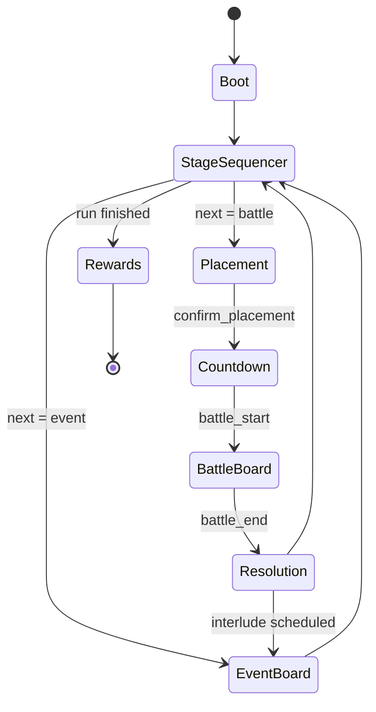

# Flow Spec（线性棋盘流，无 Hub）

本规范基于《GDD 修正案》对流程进行调整：
- 去掉 Hub，采用“无 Hub 的线性棋盘流”。
- 移除大厅与赛前配置两个大状态。
- Battle 不再是独立大状态，而是“Dynamic Stage”内部加载的战斗棋盘（BattleBoard）。
- 新增“事件棋盘”（EventBoard）作为战斗间的安全插曲，以及“StageSequencer”负责棋盘间过渡（飞走/飞入）。
- Bench 为常驻 UI（非状态），承接原 Hub 的展示/管理职责。

## 目录
- [状态机骨架](#状态机骨架)
- [Boot](#boot)
- [StageSequencer](#stagesequencer)
- [Placement](#placement)
- [Countdown](#countdown)
- [BattleBoard](#battleboard)
- [Resolution](#resolution)
- [EventBoard](#eventboard)
- [Rewards](#rewards)
- [Bench（常驻 UI）](#bench常驻-ui)

## 状态机骨架

顶层线性流程（含事件棋盘穿插）：

Boot → StageSequencer → (Placement → Countdown → BattleBoard → Resolution) ↔ EventBoard → StageSequencer → … → Rewards

说明：
- StageSequencer 负责棋盘 N 飞走 → 棋盘 N+1 飞入，并在需要时切到 EventBoard。
- BattleBoard 仅在 Stage 内部存在，用于承载战斗；战斗结束进入 Resolution。
- EventBoard 为安全棋盘（商人/工厂等），在战斗之间穿插出现，结束后回到 StageSequencer。
- Bench 为常驻 UI（非状态），全流程可见。

## Boot

职责
- 启动与配置加载：加载 `core_config`、资源与 SDK 初始化。
- 建立核心服务与数据容器。
- 发出流程起点事件：`boot_started` → `boot_ready`（或 `boot_failed`）。

转移
- Boot → StageSequencer（成功）
- Boot → Rewards（如果为快速回放或调试直达奖励的特殊模式）

## StageSequencer

职责（Dynamic Stage 过渡）
- 负责“棋盘 N 飞走 → 棋盘 N+1 飞入”的过渡与装载/卸载。
- 调度下一块棋盘是战斗（BattleBoard）还是事件（EventBoard）。

关键事件
- `stage_unloaded`：当前棋盘卸载完成。
- `stage_loaded`：下一棋盘加载完成。
- `stage_transition`：过渡中（含过场动画/镜头）。

进入/退出
- 进入：来自 Boot / Resolution / EventBoard。
- 退出：
  - 至 Placement（当下一关为战斗棋盘）。
  - 至 EventBoard（当下一步为事件棋盘）。
  - 至 Rewards（当线性关卡链路结束）。

## Placement

职责
- 部署准备：允许玩家在战斗开始前摆放/交换/出售单位。
- 生成 `snapshot_placement` 作为后续结算的依据之一。

关键事件
- `unit_place` / `unit_swap` / `unit_sell` / `confirm_placement`。

进入/退出
- 进入：来自 StageSequencer（战斗型 Stage）。
- 退出：
  - 至 Countdown（`confirm_placement`）。
  - 返回 StageSequencer（若中断或强制跳关）。

## Countdown

职责
- 战斗前倒计时与最终确认。

关键事件
- `countdown_tick` / `skip_countdown` / 触发 `battle_start`。

进入/退出
- 进入：来自 Placement。
- 退出：至 BattleBoard（`battle_start`）。

## BattleBoard

定义
- BattleBoard 是 Stage 内部的“战斗棋盘”，由 StageSequencer 动态加载/卸载。

职责
- 运行战斗逻辑（单位生成/AI/碰撞/掉落等），产出 `snapshot_battle`。

关键事件
- `unit_downed`：单位倒地。
- `extraction_start`：开始撤离流程（若存在）。
- `extraction_complete`：撤离完成（若存在）。
- `battle_end`：战斗结束（胜/负/平/特殊条件）。

进入/退出
- 进入：来自 Countdown。
- 退出：至 Resolution（`battle_end`）。

## Resolution

职责
- 依据 `snapshot_battle` + `snapshot_placement` 生成战后结果与收益（含 Essence 等）。
- 产出 `resolution_result`，用于后续奖励或分支。

关键事件
- `resolution_open` / `resolution_confirm`。

进入/退出
- 进入：来自 BattleBoard。
- 退出：
  - 至 StageSequencer（继续下一关）。
  - 或至 EventBoard（若排程有战间事件）。

## EventBoard

定义
- 安全棋盘，用于承载商人、工厂、剧情互动等非战斗事件；可包含过场与过渡动画。

职责
- 提供事件交互与结算，可能影响后续战斗参数/资源。

关键说明
- EventBoard 与战斗链路解耦，仅在“战斗之间”的插曲阶段出现。

进入/退出
- 进入：来自 StageSequencer 或 Resolution（根据调度/排程）。
- 退出：至 StageSequencer（完成事件后继续线性流程）。

## Rewards

职责
- 基于 `resolution_result` 与全程累积数据发放奖励/结算通关。

关键事件
- `reward_granted` / `reward_skipped` / `extract_commit`（若需要）。

进入/退出
- 进入：来自 StageSequencer（线性链路结束）。
- 退出：流程终止或返回 Boot（仅调试/回放场景）。

## Bench（常驻 UI）

- Bench 为常驻 UI（非状态），贯穿全流程存在，用于单位管理、信息展示等；
- 原 Hub 的展示/管理类职责迁移为 Bench 的常驻能力，不再以“Hub 状态”形式出现。

## Mermaid 状态图（线性棋盘流 + 事件棋盘穿插）

