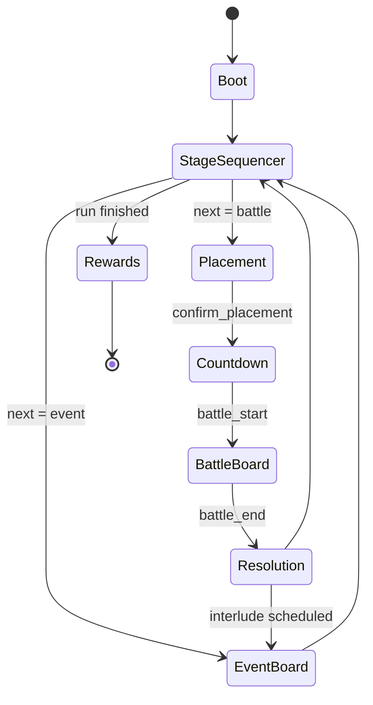

# Framework（核心框架规范）

基于《GDD 修正案》的框架更新，统一与最新 Flow Spec（线性棋盘流、无 Hub）保持一致：
- 采用“无 Hub 的线性棋盘流”；Bench 为常驻 UI（非状态）。
- 移除角色分工（坦克/输出/控制/支援）；单位差异来自“V23 混沌生成”。
- 将 Extraction 改回“V1.7 Essence 对抗链”。
- AI 采用 V4.0 阶级 AI（小哥布林 vs 大哥布林），替代 Managers/Workers 学术化定义。

## 目录
- [玩法循环与场景](#玩法循环与场景)
- [单位与属性](#单位与属性)
  - [混沌生成（V23）](#混沌生成v23)
- [状态与出局](#状态与出局)
- [AI 框架](#ai-框架)
- [Bench（常驻 UI）](#bench常驻-ui)
- [附：主状态机图](#附主状态机图)

## 玩法循环与场景

顶层线性流程（与 docs/FLOW_SPEC.md 对齐）：

Boot → StageSequencer → (Placement → Countdown → BattleBoard → Resolution) ↔ EventBoard → StageSequencer → … → Rewards

说明：
- StageSequencer：负责“棋盘 N 飞走 → 棋盘 N+1 飞入”的 Dynamic Stage 过渡，调度战斗棋盘或事件棋盘。
- BattleBoard：Stage 内部的战斗棋盘，战斗完成后进入 Resolution。
- EventBoard：安全棋盘（商人/工厂/剧情等），战斗之间的插曲，结束后回到 StageSequencer。
- Bench：常驻 UI（非状态），贯穿全流程可见与可用。

## 单位与属性

- 不再区分传统的“职业分工（坦克/输出/控制/支援）”。
- 单位差异性来自“混沌生成（V23）”的组合与波动（见下）。
- 基础属性仍包含：生命、攻击、护甲、抗性、速度、能量等（按制品需裁剪/扩展）。

### 混沌生成（V23）

单位由以下要素组合并受随机因子扰动，形成可解释但高多样的个体差异：
- 模板（Template）：单位骨架定义，如体型、移动类型、装备插槽、基础成长曲线。
- 颜色数值（Color Stats）：用色彩通道映射数值偏置与风格（例：红/蓝/绿分别偏向伤害/控制/生存）。
- 职业（技能）：授予一套职业技能与触发器，决定作战套路与连携上限。
- 随机词条（Affixes）：从词条池抽取正/负向词条，影响数值、触发、AI 倾向或交互。
- 生成可采用确定性 Seed 以便回放与测试，一次生成产出 `unit_blueprint` 供后续快照使用。

## 状态与出局

将 Extraction 改回“V1.7 Essence 对抗链”，并对齐 Flow Spec 的事件命名：
- HP = 0 → 进入 Downed（倒地，不可行动）。
- 触发 `extraction_start`：双方围绕该单位的 Essence 进行对抗（可被打断）。
- 对抗中断事件：`extraction_interrupted`（包括被击退、保护圈破裂、操作者倒地等）。
- 当目标 Essence 降至 0 → `extraction_complete` → Removed（移除出局）。
- 若在对抗中被救回（治疗/复活等），终止该对抗链，单位脱离 Downed 并重置相关计量。

事件与快照
- 与 BattleBoard 同步产出 `snapshot_battle`；对抗过程中的关键帧用于回放与结算解释。

## AI 框架

采用“V4.0 阶级 AI”，强调“可解释的不稳定性 vs 稳定性”的对照：
- 小哥布林（不稳定）：
  - 固有“非理性”词条（如：冲动、贪婪、怯战、好奇扰动）。
  - 行为具有可解释的偏执/噪声源，用于制造战场不确定性与 emergent play。
- 大哥布林（稳定）：
  - 无固有词条（0 内置偏置），理性决策，遵循清晰的目标/威胁/收益评估。
  - 作为基准稳定层，保证可控的战术反馈与规则可学习性。
- 组合与落地：
  - 通过阵列配置将两阶 AI 混编，以形成局部混沌与整体可预期的节律。
  - 替代旧的 Managers/Workers 学术化抽象，降低解释成本、提升观感一致性。

## Bench（常驻 UI）

- Bench 为常驻 UI（非状态），承接原 Hub 的展示/管理职责（单位管理、信息面板、装配等）。
- 与 Stage/Battle/Event 棋盘解耦，状态切换不中断其可见性与可交互性（按安全策略限制关键操作）。

## 附：主状态机图

与 Flow Spec 保持一致的 Mermaid 图：

